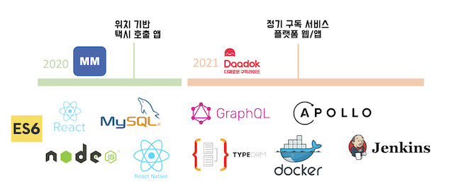
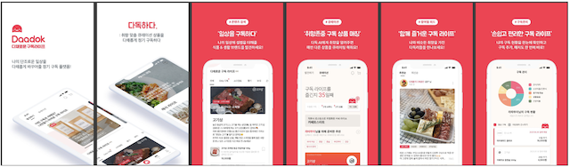
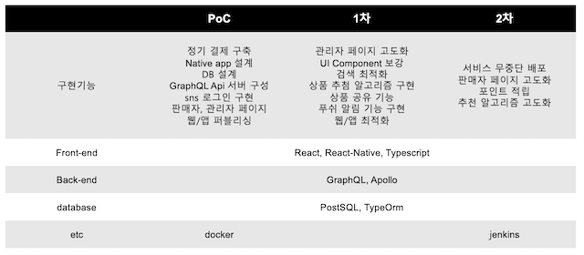
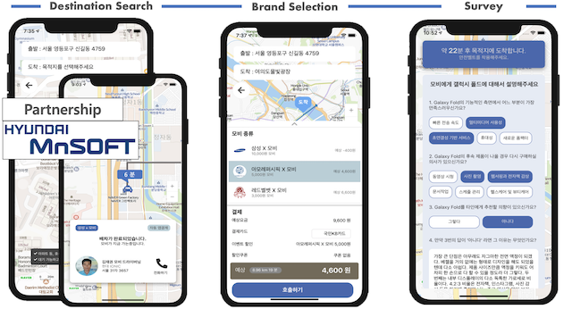

## About Me

안녕하세요. 2년차 개발자 김재권입니다.

18~20년도까지 삼성전자 메모리사업부를 다니다가 창업을 하고자 나와 개발자로 새로운 시작을 하게 되었습니다.

처음에는 막막하였지만 동료들의 도움과 끊임없는 자기계발을 통해 기본적인 지식을 쌓아 탄탄한 토대를 마련하였고 이를 발전시켜 여러 아이템을 만들 수 있었습니다. 지식 뿐만 아니라 앱을 실제 운영을 하면서 react, typescript, apollo, typeorm 등 프론트엔드 뿐만 아니라 graphql 서버까지 개발을 하면서 자연스럽게 둘의 상호작용 방식을 이해하게 되었고 원활한 코드를 짤 수 있게 되었습니다. 그리고 프론트엔드를 하면서 UX/UI 디자이너와 Zeplin UI 설계,협업 툴을 사용하여 빌더 웹 화면 디자인을 하며 개발자와 디자이너 간의 소통하는 방식을 배울 수 있었습니다.

이러한 소중한 경험들을 쌓아가며 실사용자들에게 즐거움을 주고, 삶을 좀더 편하게 해줄 수 있는 서비스를 만드는 개발자가 되기 위해 노력하고 있습니다.

동료들과의 소통이 무엇보다 중요함을 알고 개발자 분들과는 끊임없는 코드 리뷰, 기술 공유 등을 함으로써 함께 발전하는 것을 좋아합니다.

## Technical Skill

삼성전자를 다니면서 기본적인 javascript, css 등을 공부해 왔고 창업을 하며 좀 더 이론적인 지식과 실무적인 기술을 쌓았습니다.

2020년 하반기에 모비라는 서비스를 만들기 위해 react, react-native를 기반으로 프론트엔드를 구현하였고 graphql 서버와의 데이터 통신 방법을 익힐 수 있었습니다. 택시 호출 앱으로서 subscribing을 통한 서버와의 연결을 유지하며 실시간으로 map에 표시하는 부분을 구현하였습니다. 실제 배포를 나가진 않았지만 기능 구현과 전반적인 디자인은 끝낸 상태로 마무리하였고 개발의 토대를 쌓을 수 있는 값진 경험이었습니다.

2021년 새로운 아이템인 daadok이라는 서비스를 기획하였습니다. 프론트엔드 뿐만 아니라 백엔드 까지 동료들과의 협업으로 처음부터 구축해 나갔습니다. 우선 탄탄한 토대를 위해 typeorm을 기반으로 정기결제에 적합한 DB를 구현하였습니다. 이를 바탕으로, 효율적인 graphql api를 만들어 프론트엔드에서의 호출을 원활히 하였습니다. 뿐만 아니라, 전반적인 프론트엔드 페이지를 구현하면서 component, state 관리 등 다양한 기술을 익히고 적용해 안정적인 서비스를 제공하기 위해 끊임없이 노력하였습니다.

### Programing Language
  - JavaScript, Typescript, Node.js, HTML

### Framework / Library
  - React, React-Native, GraphQL, TypeORM, Redux

#### DB
  - PostSQL

#### Etc
  - Git, Firebase, Notion, Slack

## Project

### (1) Daadok

- 2021.01. ~ 2022.01.

- 생활 구독 매칭 서비스 플랫폼

- 기술 : React, React-Native, GraphQL, Apollo, MySQL

- 역할
    1. 앱/웹 UI 구성 및 서버 API 환경 구축
    2. DB 구조, 설계
    3. 정거결제 시스템 구축 

** 프로세스 추진 과정

[ Technical ]

* React 기반 Web 프론트엔드(플랫폼, 관리자) 개발 
* React-Native 기반 APP 프론트엔드 개발
* TypeORM 을 활용하여 사용자 / 상품 / 정기구독 서비스 DB 설계 및 적용 
* 결제 시스템(결제,취소,환불 등) 및 정기결제 프로세스 구축
* 쿼리, 뮤테이션, 스키마, 리졸버를 바탕으로 api 생성 
* Docker 및 Jeckins 활용하여 무중단 배포 환경 구축 
* JWT token을 활용한 유저, 관리자, 판매자 구분

### (2) Moby

- 2020.07. ~ 2020.12.

- 택시를 활용한 새로운 광고 솔루션

- 기술 : React, React-Native, GraphQL

- 역할
    1. 앱 UI 구성 및 Navigation 연결
    2. SNS(kakao, naver) 로그인 구현
    3. Subscription을 통한 택시 매칭 화면 구현

[ Technical ]

* React-Native 기반 APP 프론트엔드 개발
* SDK 연동을 통한 로그인 화면 구현
* 사용자 설문 및 매칭 시스템 구현

### Project
* git을 통한 코드 관리
* 사용자 앱/웹 및 인터페이스 코드 컨벤션 준수
* 인터페이스 정의서 및 설계안 작성

